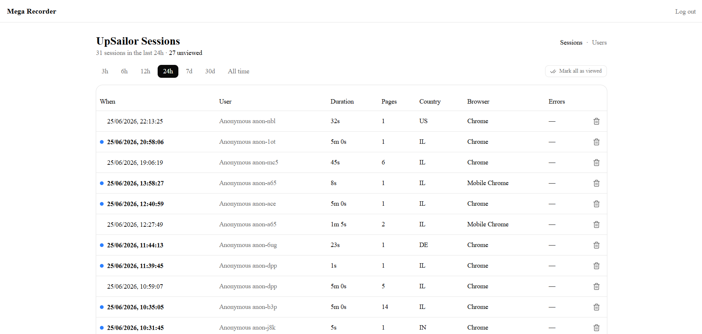
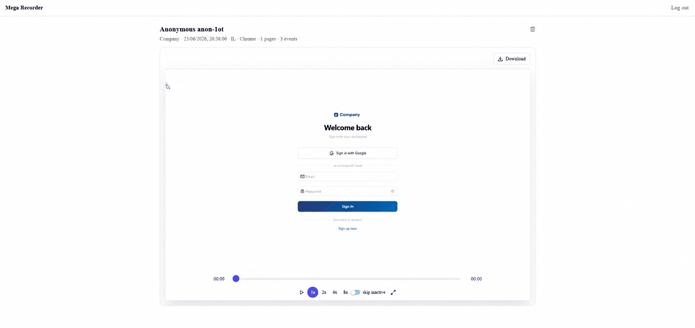
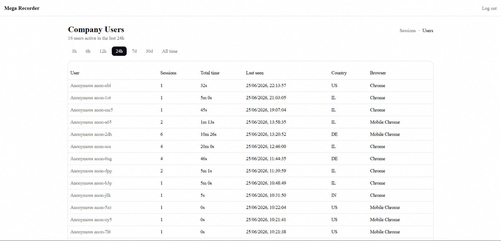
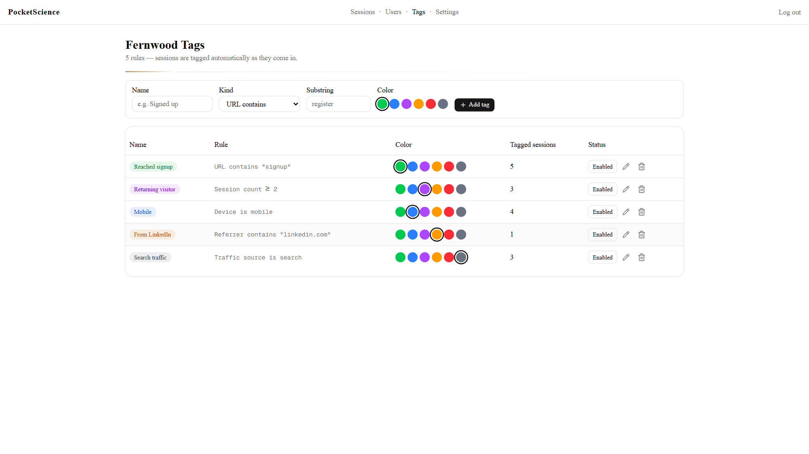

# PocketScience

**Session replay on your own server: recordings, step-by-step narratives, self-hosted AI summaries, visitor profiles. Free for personal and noncommercial use.**

Records real user sessions with [rrweb](https://github.com/rrweb-io/rrweb), stores them in your own Postgres, replays them from a built-in dashboard. One Next.js app - ingest and dashboard ship together, so it's cheap to run and the data never leaves your server.


**License:** [PolyForm Noncommercial 1.0.0](LICENSE) - free for personal/educational/noncommercial use; commercial use needs a license from the author.
**Privacy:** complying with GDPR/CCPA/etc. is on you - use the [masking options](#privacy-modes) and disclose recording in your privacy policy.

---

## What you get

- **Session replay** - live URL bar that follows the visitor across pages, speed controls, skip-inactive, one-click MP4 export.
- **Session narratives** - every session becomes a step-by-step story ("Landed on /home → clicked 'Pricing' → typed in the email field") with frustration badges: 🔥 rage clicks, 💀 dead clicks, 📝 abandoned forms, 🔁 pogo-sticking. Deterministic - no AI required.
- **AI layer, optional and self-hosted** - per-session intent summaries (with the model reading replay screenshots, not just text) and rolling visitor profiles, via the bundled [LLM service](#the-ai-layer-optional). Nothing goes to any third party.
- **Users** - sessions aggregated per visitor, with their AI profile when the LLM layer is on.
- **Tag rules** - auto-tag sessions by URL match or visit count, each rule with its own color, applied retroactively too.
- **Controls** - privacy masking, exclude your own team from recording, per-admin viewed tracking, sortable tables, retention and session caps.

## Quick start

**Prerequisites:** Node.js 20+, a Postgres database.

```bash
git clone https://github.com/XiRoSe/pocketscience-oss.git
cd pocketscience-oss
npm install
cp .env.example .env.local        # edit the values
npm run db:migrate                # apply schema to your Postgres
npm run dev
```

Open <http://localhost:3000>, log in with the `ADMIN_EMAIL` / `ADMIN_PASSWORD` from your `.env.local`. A default org/project is created on first boot.

## Record sessions on your site

Copy the **project key** (`umsk_...`) from the project's page in the dashboard, then drop one script tag on the pages you want to record:

```html
<script
  src="https://your-recorder.example.com/tracker.js"
  data-project-key="umsk_xxxxxxxxxxxxxxxxxxxx"
  data-privacy-mode="mask_all_inputs"
></script>
```

| Attribute | Required? | What it does |
| --- | --- | --- |
| `src` | ✅ | Your own deployment of this app - it serves the tracker and receives the events. |
| `data-project-key` | ✅ | Which project the session is filed under. |
| `data-privacy-mode` | - | `default`, `mask_all_inputs`, or `strict` - see [Privacy modes](#privacy-modes). |
| `data-api-origin` | - | Only if `tracker.js` is served from a different host (e.g. a CDN) than the recorder API. |

Sessions show up within a few seconds. `window.PocketScience` exposes `identify()` / `stop()` (`window.MegaRecorder` still works as a legacy alias); bundled apps can `import { initRecorder } from './lib/tracker'` instead.

## The AI layer (optional)

Narratives work out of the box, no model needed. The LLM extras run on your own hardware:

1. Deploy the bundled [`private-multimodel-llm-service/`](private-multimodel-llm-service/README.md) - llama.cpp serving Qwen3.5-4B (Q4_K_M) with a vision adapter, behind an OpenAI-compatible API. The model is baked into the image; any OpenAI-compatible endpoint works too.
2. Set `LLM_SERVICE_URL` on the app.

What turns on:

- **Intent summaries** - a 2-3 sentence read per session: what the visitor wanted, where they got stuck.
- **Visual analysis** - the summary call also attaches up to two replay screenshots (the first friction moment and the last thing the visitor saw), rendered headlessly and read by the same model through its vision adapter.
- **Visitor profiles** - once a visitor has 2+ summarized sessions: who they are, what they keep trying to do, where they come from, and how their visits are going - shown on the Users page.

Each stage has its own toggle under **Settings → AI features**. Unset `LLM_SERVICE_URL` and the AI layer pauses; narratives keep working. Session data never leaves your infrastructure either way.

## Screenshots

**Sessions list** - recent sessions with duration, pages, country, browser, and per-admin unviewed indicators.



**Session replay** - scrub through a recorded session with speed controls, skip-inactive, and one-click MP4 export.



**Users** - sessions aggregated per visitor.



**Tags** - admin-editable rules that auto-tag sessions by URL or visit count.



## How it works

```
 ┌────────────┐  tracker.js (rrweb)  ┌───────────────────────────────────┐
 │ Your site  │ ───────────────────► │  PocketScience (one Next.js app)  │
 │  + <script>│  POST /api/ingest/…  │                                   │
 └────────────┘                      │  ingest API ──► Postgres          │
                                     │  (events gzipped inline, no       │
   Admin dashboard  ◄──────────────  │   object store or volume)         │
   replay · narratives · users       │                                   │
                                     │  background workers:              │
                                     │  digest ► narrative ► AI summary  │
                                     │  summaries ► visitor profiles     │
                                     └──────┬─────────────────────┬──────┘
                       (optional) job queue │          (optional) │ OpenAI-compatible
                        ┌───────────────────▼┐  ┌─────────────────▼──────────┐
                        │ Redis + BullMQ     │  │ private-multimodel-llm-    │
                        │ summaries·profiles │  │ service: llama.cpp with    │
                        │ (else in-process)  │  │ Qwen3.5-4B + vision adapter│
                        └────────────────────┘  └────────────────────────────┘
```

1. The tracker records rrweb events and posts them to the ingest API; they're gzipped and stored inline in Postgres.
2. A background sweep inside the app turns each ended session into a deterministic digest: the narrative and its frustration badges. No model involved, works retroactively.
3. With `LLM_SERVICE_URL` set, workers send each digest (plus replay screenshots when Visual analysis is on) to the LLM service for the intent summary, then build visitor profiles from those summaries.
4. With `REDIS_URL` set, the queue carries deduped job signals and BullMQ workers (running inside the app, like everything else) pick them up; without Redis an in-process loop does the same work. Either way it's always the app that calls the LLM, and the database rows stay the source of truth - a reconciler re-derives any work Redis loses.

Everything lives in one Postgres database: `sessions` holds the metadata and the gzipped rrweb event blob inline (no object store), `session_summaries` holds each session's digest, narrative, and AI summary - the row doubles as the work-queue entry with status/attempts/retry columns - and `user_profiles` does the same for visitor profiles. Around those: `tag_rules` + `session_tags`, `session_views` (per-admin viewed state), `excluded_anon_ids`, `admin_users`, and `app_settings` (the AI feature toggles). Sessions (with their replays and summaries) age out with per-project retention; visitor profiles are kept.

The tracker's wire protocol is stable for drop-in script tags: `ps_anon_id` / `ps_session_v2` storage keys, `x-ps-end` header, `data-ps-mask` attribute, `window.PocketScience` global. The pre-rebrand `mega_*` names are still honored, so old embeds keep working (see `LEGACY_TRACKER_COMPAT`).

## Configuration

| Variable | Required | Description |
| --- | --- | --- |
| `DATABASE_URL` | ✅ | Postgres connection string. |
| `JWT_SECRET` | ✅ | Signs admin session cookies (32+ bytes). |
| `INGEST_TOKEN_SECRET` | ✅ | Signs per-project ingest tokens (32+ bytes). |
| `ADMIN_EMAIL` / `ADMIN_PASSWORD` | ✅* | Single admin login, seeded on boot. |
| `ADMINS_CREDS` | ✅* | JSON array of `{ "email", "password" }` for multiple admins. |
| `LLM_SERVICE_URL` | - | OpenAI-compatible endpoint for the [AI layer](#the-ai-layer-optional). Unset = AI off. `SUMMARIZER_URL` works as a legacy alias. |
| `LLM_SERVICE_MODEL_LABEL` | - | Label stored with each AI summary (e.g. `qwen3.5-4b-q4km`). `SUMMARIZER_MODEL_LABEL` works as a legacy alias. |
| `REDIS_URL` | - | Optional. Moves AI processing onto BullMQ workers; without it an in-process loop does the same work. |
| `ORG_NAME` | - | Name for the auto-created org/project (default `My Company`). |
| `LEGACY_TRACKER_COMPAT` | - | Keep honoring the pre-rebrand `x-mega-end` header (default `true`). |

\* Provide **either** `ADMIN_EMAIL`+`ADMIN_PASSWORD` **or** `ADMINS_CREDS`. Generate secrets with `openssl rand -base64 32`.

## Privacy modes

| Mode | Behavior |
| --- | --- |
| `default` | Records normally. |
| `mask_all_inputs` | Masks every `<input>` / `<textarea>` value. |
| `strict` | Masks all inputs **and** any element carrying `data-ps-mask` (or the legacy `data-mega-mask`). |

## Deployment

The Dockerfile's start command runs migrations, then the server - no separate migrate step:

```
node scripts/migrate.mjs && node server.js
```

Health check at `/api/health`. A `railway.toml` is included: `railway up` and you're done.

## Testing

```bash
npm test          # unit tests (vitest) - DB tests skip unless DATABASE_URL is reachable
npm run lint      # eslint
npm run build     # production build + type-check
npm run test:e2e  # Playwright
```

## Contributing

Contributions welcome! Read [CONTRIBUTING.md](CONTRIBUTING.md) and the [Code of Conduct](CODE_OF_CONDUCT.md). Security issues: [SECURITY.md](SECURITY.md), not a public issue.

## PocketScience Cloud

This repo is the free, self-hosted core. The hosted product at [pocketscience.ai](https://www.pocketscience.ai) adds the paid layer:

- **AI researcher** - ask questions about your sessions in plain language
- **Visitor clustering** - behavioral segments discovered automatically
- **Timeline analytics** - hourly rollups, trends, and metric charts with AI reads
- **Overview dashboard** and **team management** (multi-admin, roles, self-serve signup)
- Managed hosting, or we deploy the whole thing on your infrastructure

Want it? [Contact us](https://www.pocketscience.ai/#contact).

## License

[PolyForm Noncommercial License 1.0.0](LICENSE) © 2026 Matan Avitan - free for personal, educational, and other noncommercial use. For commercial licensing, contact the author.
